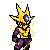
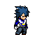

# 🕹️ Cyberpunk Revolution (2D Fighting Game)

## Overview
**Cyberpunk Revolution** is an arcade-style 2D fighting game developed entirely from scratch using **Java** and **JOGL (Java Bindings for OpenGL)**. Moving beyond standard university projects, this game abandons pre-built engines to focus on core Object-Oriented Programming (OOP), complex state management, and low-level rendering pipelines.

## 🎮 Key Features

* **Dynamic AI & Multiplayer:** Play against a scalable, intelligent AI (`AIController`) or battle a friend in local competitive multiplayer.
* **Complex State Management:** A robust state machine seamlessy handles transitions between Main Menu, Character Select, Gameplay, and Pause screens.
* **Custom Animation Engine:** Engineered a sprite animator to handle idle, walk, attack, and hit states smoothly.
* **Low-Level Rendering:** Clean and straightforward visuals built directly upon OpenGL foundations using JOGL.

## 🎯 Character Showcase

The primary combatants feature unique standard attacks and a devastating Special Attack. 

|                Red Fighter (Player 1)               |                Blue Fighter (Player 2)               |
| :-------------------------------------------------: | :-------------------------------------------------: |
| **** | **** |

---

## 🚀 Quick Start

To run the game on your system, follow these steps:

1. **Clone the Repository:**
   ```bash
   git clone [https://github.com/YourUsername/Cyberpunk_Revolution.git](https://github.com/YourUsername/Cyberpunk_Revolution.git)
   cd Cyberpunk_Revolution
2. **Add JOGL Libraries:**

   * Download the appropriate **JOGL** (Java OpenGL) binaries for your operating system.
   * Add the necessary **`.jar`** files for JOGL to the project's Build Path configuration.
3. **Run the Game:**

   * Execute the main file: `src/engine/Game.java`.

## 🕹️ Controls

Get ready to fight! Here are the control keys for each player:

### Player 1 (Red Character)

| Action                        | Key |
| :---------------------------- | :-- |
| **Move Left**                 | `A` |
| **Move Right**                | `D` |
| **Move Up**                   | `W` |
| **Move Down**                 | `S` |
| **Attack / Shoot Power Ball** | `F` |
| **Spacial Attack**            | `G` |

### Player 2 (Blue Character)

| Action                        | Key       |
| :---------------------------- | :-------- |
| **Move Left**                 | `← Arrow` |
| **Move Right**                | `→ Arrow` |
| **Move Up**                   | `↑ Arrow` |
| **Move Down**                 | `↓ Arrow` |
| **Attack / Shoot Power Ball** | `Enter`   |
| **Spacial Attack**            | `Shift`   |

---

## 📁 File and Folder Structure

```
Cyberpunk_Revolution/
├── src/
│   ├── engine/
│   │   ├── Game.java           # The main entry point and game loop.
│   │   └── TextureLoader.java  # Responsible for loading graphical resources.
│   └── entities/
│       └── Player.java         # Base class for representing the players.
└── assets/                     # Contains all image files and graphics.
└── (Character images, backgrounds...)
```

## 🛠️ Technical Requirements

Below are the tools and versions used:

* Java Development Kit (JDK) 8 or later.
* JOGL Version: **JOGL 1.1.1**

---

<video src="CyperPunk%20Revuotion.mp4" width="100%" controls>
  Your browser does not support the video tag.
</video>

---
